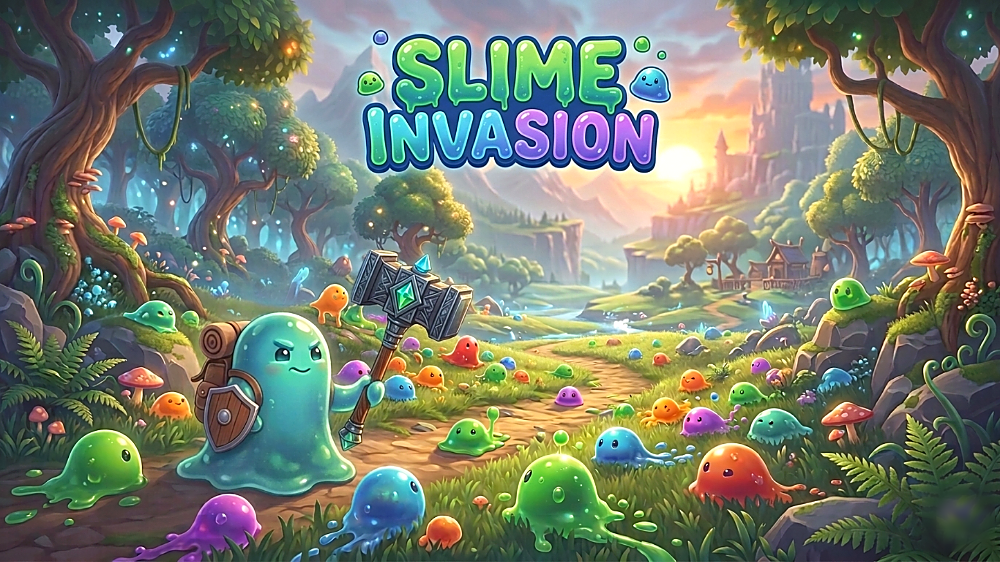

# Slime Invasion

A 3D survival-arena game built directly on **DirectX 11** — no game engine, no
rendering framework. Everything from the swap chain to the shadow map is written
against the raw D3D11 API.



<p>
  
  
  
  
</p>

---

## Gameplay

Slimes spawn around the arena and close in on the player. A war hammer orbits
you automatically, spinning faster the longer you survive — position yourself so
it connects. Enemies get faster and tougher over time, and the score comes from
how strong the slimes you destroy were.

| Input | Action |
|-------|--------|
| `W` `A` `S` `D` | Move |
| `Space` | Jump |
| `Enter` | Start game (title screen) |
| `Esc` | Quit |

The hammer swings on its own — survival is about movement and spacing, not aiming.

---

## Technical highlights

The interesting part of this project is the renderer, all of it hand-written.

### Shadow mapping
- 2048×2048 depth pass rendered from an **orthographic light camera** — the
  correct projection for a directional sun, where light rays are parallel.
- **Texel snapping**: the light frustum's centre is quantised to whole shadow-map
  texels in light space. Without it, sub-texel camera movement makes every shadow
  edge crawl and shimmer.
- **3×3 PCF** with a **slope-scaled depth bias** (`max(maxBias·(1−N·L), minBias)`),
  which removes shadow acne on angled surfaces without detaching shadows from
  their casters.
- A dedicated point-filtered sampler with a white border, so PCF compares each
  texel individually and geometry outside the light frustum reads as lit.
- The light camera follows the player, keeping the shadow map centred on what is
  actually on screen.

### Lighting
- Directional key light plus up to **four point lights**, each with range-based
  attenuation.
- **Hemisphere ambient** — sky colour from above blended with a warm bounce from
  below — instead of a flat ambient constant.
- **Blinn-Phong** specular masked by `N·L`, so unlit surfaces cannot glint.
- Shadows attenuate *direct* light only; ambient is left intact, so shadowed
  areas keep their colour rather than washing out to grey.
- A shared `shadow.hlsli` include keeps the lit-object and terrain shaders using
  one identical shadow lookup.

### Rendering
- Model loading via **Assimp** with per-mesh vertex/index buffers and materials.
- **Skeletal animation** (bone IDs and weights in the vertex layout).
- Camera-facing **billboards** and animated sprites for effects.
- **Terrain** built from a procedural mesh field with two blended detail textures.
- Skybox, circle shadows, bullet trajectories and particle effects.
- Offscreen render targets and an orthographic sprite/UI pass.

### Architecture
- **Scene stack** driving title → game → result transitions.
- Enemy AI built on the **State pattern** (`Patrol` / `Chase`) behind a polymorphic
  `Enemy` base.
- AABB and sphere collision primitives.
- A free-look **debug camera** that can be swapped in for the gameplay camera.
- Lighting resources wrapped in a `LightRenderer` class using RAII (`ComPtr`) and
  constructor dependency injection.

---

## Building

**Requirements**

- Windows 10/11 (x64)
- Visual Studio 2022 with the **Desktop development with C++** workload
- Platform toolset **v143**, Windows SDK 10

**Steps**

1. Open `2dGame.sln` in Visual Studio 2022.
2. Select the **x64** platform and either `Debug` or `Release`.
3. Build and run (`F5`).

Everything needed is in the repository — no package manager step. The build:

- compiles the HLSL in `shaders/` to `.cso` files in `resource/shader/`
  (`FxCompile → ObjectFileOutput`), and
- copies `resource/` and `assimp-vc143-mt.dll` next to the executable in a
  post-build step.

Compiled shaders are generated artifacts and are intentionally not tracked in git;
they appear on the first build.

---

## Project structure

```
src/
  core/       entry point, game loop, scene stack, Direct3D device, timing
  render/     shaders, sprites, textures, models, lighting, billboards, particles
  gameplay/   player, enemies, bullets, hammer, map, collision, score
  camera/     gameplay camera, debug camera, shadow-map light camera
  input/      keyboard, mouse, key logger
  audio/      sound playback
  ui/         title screen, HUD, result screen, text, fades
  external/   WICTextureLoader
shaders/      HLSL sources (.hlsl) and the shared shadow.hlsli include
resource/     textures, models, audio, compiled shaders
lib/          DirectXTex binaries
tools/        helper scripts
```

---

## Dependencies

| Library | Purpose | How it is linked |
|---------|---------|------------------|
| [Assimp](https://github.com/assimp/assimp) | Model import (FBX) | Bundled `.lib`/`.dll`, linked via `#pragma comment` |
| DirectXTex | Texture helpers | Bundled in `lib/` |
| WICTextureLoader | PNG/WIC texture loading | Source included in `src/external/` |
| Direct3D 11, XInput, winmm | Rendering, gamepad input, audio playback | Windows SDK |

> The `assimp/assimp/` subdirectory is **not** a stray duplicate — with
> `AdditionalIncludeDirectories=assimp`, `#include "assimp/scene.h"` resolves
> through it. Removing it breaks the build.
>
> Include-path order matters as well: `src\*` must come **before** `assimp`,
> because Assimp ships headers named `scene.h`, `texture.h`, `light.h` and
> `camera.h` that collide with this project's own.

---

## Possible improvements

- Replace the scene `switch` statements with a polymorphic `IScene` hierarchy.
- Continue migrating the remaining module-level globals into classes, following
  the `LightRenderer` pattern.
- Cascaded shadow maps for sharper shadows across a larger view distance.
- Re-enable and encapsulate the bullet/enemy collision pass in a dedicated system.
